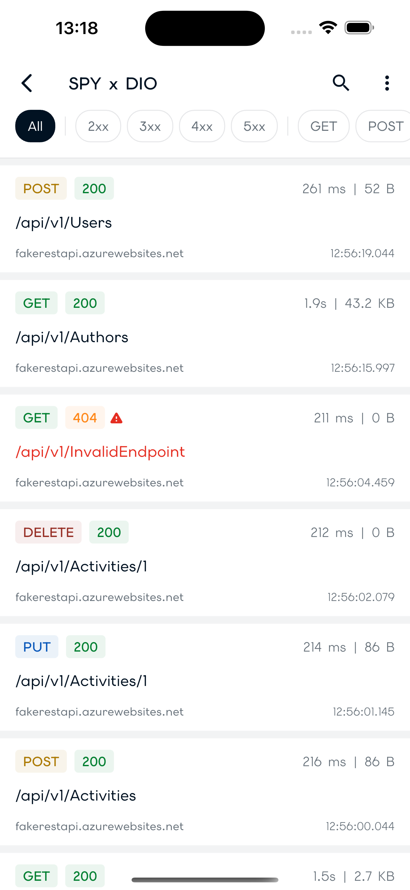
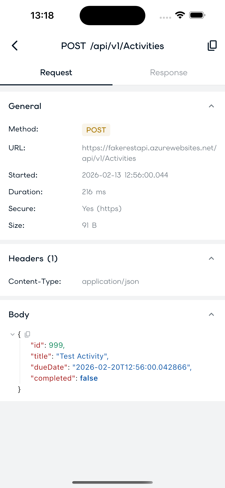
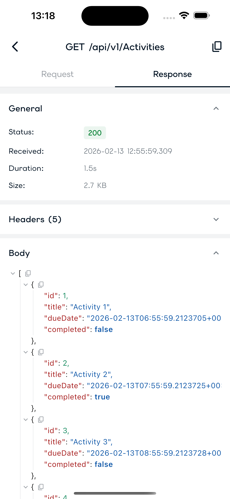
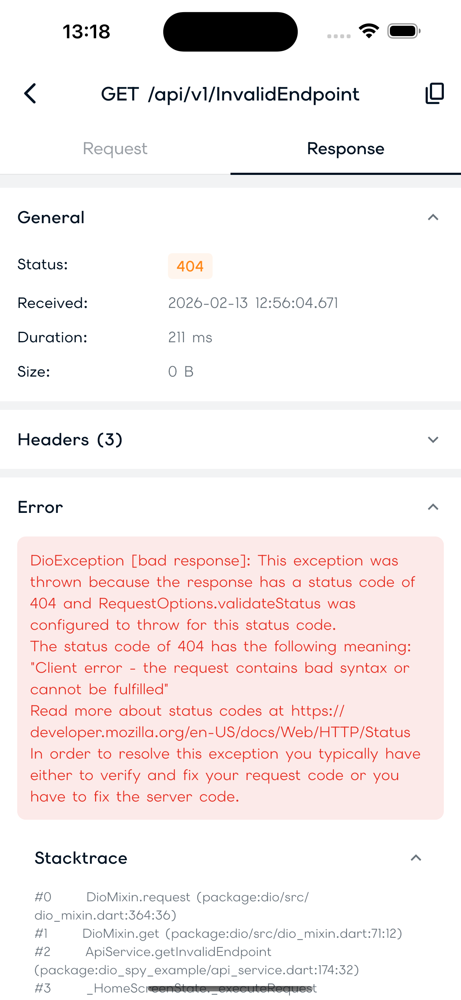

# NetSpy

A lightweight HTTP inspector for Dio with a clean minimal UI. Monitor and debug your HTTP calls with ease!

## Features

- ✨ **Automatic Request Capture** - Intercepts all Dio HTTP calls automatically
- 🌐 **All HTTP Methods** - GET, POST, PUT, PATCH, DELETE, HEAD, OPTIONS (with color-coded chips and filters)
- 🫧 **Floating Bubble** - A draggable button to open the inspector on any platform (device, emulator, desktop, web)
- 📱 **Shake to Inspect** - Or open the inspector by shaking your device/simulator
- 🎨 **Clean Minimal UI** - Beautiful, easy-to-use interface
- 📋 **Copy as cURL** - Copy any request as a cURL command
- ⚡ **Request Timing** - See how long each request takes
- 🎯 **Quick Filter** - Quickly find your requests by URL, HTTP method and status code
- 💾 **In-Memory Storage** - Configurable circular buffer (default: 1000 calls)
- 🗄️ **Persistent Storage** - Optionally keep calls across app restarts (backed by `shared_preferences`)
- ⏳ **Auto Retention** - Optionally prune calls older than a chosen duration
- 🗑️ **Swipe to Delete** - Remove a single call by swiping it away, or clear all at once
- 🔗 **Share** - Share a single request (or all of them) as cURL via the native share sheet
- 🙈 **Header Redaction** - Toggle masking of sensitive headers/cookies (Authorization, Cookie, tokens…)
- 🏷️ **Custom Title** - Rename the inspector to match your internal tooling
- 🚫 **Release-Safe** - Disabled automatically in release builds (`enabled` defaults to `kDebugMode`)
- 🌳 **JSON Visualizer** - Interactive JSON tree viewer

## Screenshots

<table style="border-spacing: 20px;">
  <tr>
    <td align="center" style="padding: 15px;">
      <br/>
      <sub><b>Call List Screen</b></sub>
    </td>
    <td align="center" style="padding: 15px;">
      <br/>
      <sub><b>Request Details</b></sub>
    </td>
  </tr>
  <tr>
    <td align="center" style="padding: 15px;">
      <br/>
      <sub><b>Response Details</b></sub>
    </td>
    <td align="center" style="padding: 15px;">
      <br/>
      <sub><b>Error Handling</b></sub>
    </td>
  </tr>
</table>

## Installation

Add this to your `pubspec.yaml`:

```yaml
dependencies:
  net_spy:
    git: https://github.com/7wilightxdev/net_spy.git
    # or, for a local/internal copy:
    # path: ../net_spy
```

Then run:

```bash
flutter pub get
```

## Quick Start

### 1. Initialize NetSpy

```dart
import 'package:dio/dio.dart';
import 'package:net_spy/net_spy.dart';

// Create NetSpy instance
final NetSpy = NetSpy(
  showOnShake: true,  // Enable shake gesture
  maxCalls: 1000,     // Max number of calls to store
  persistent: true,   // Keep calls after the app restarts (optional)
  retentionPeriod: const Duration(hours: 12), // Auto-prune old calls (optional)
  title: 'My App Network',   // Rename the inspector (optional)
  redactHeaders: false,      // Start with header redaction off (optional)
  // enabled: defaults to kDebugMode — NetSpy is off in release builds.
);
```

### 2. Attach NetSpy to Dio

```dart
// One-liner: attaches the interceptor and returns the same Dio instance.
final dio = NetSpy.attachTo(Dio());

// Attach to several Dio instances at once:
NetSpy.attachToAll([authDio, apiDio, uploadDio]);

// Or the manual way (equivalent):
// dio.interceptors.add(NetSpy.interceptor);
```

### 3. Connect the Inspector UI

You have two options to display the inspector:

#### Option A: NetSpyWrapper (Recommended)

Use `NetSpyWrapper` in your `MaterialApp.builder`. No navigator key needed. This
also shows a **draggable floating bubble** you can tap to open the inspector
(handy on emulators, desktop, and web where shaking isn't possible).

```dart
MaterialApp(
  builder: (context, child) => NetSpyWrapper(
    NetSpy: NetSpy,
    child: child!,
    // showBubble: false, // set to false to hide the floating bubble
  ),
  home: MyHomePage(),
);
```

#### Option B: Navigator Key

Pass a `GlobalKey<NavigatorState>` so NetSpy can push the inspector as a route.

```dart
final navigatorKey = GlobalKey<NavigatorState>();

MaterialApp(
  navigatorKey: navigatorKey,
  home: MyHomePage(),
);

NetSpy.setNavigatorKey(navigatorKey);
```

### 4. Make HTTP Requests

All requests made through your Dio instance will be automatically captured!

```dart
final response = await dio.get('https://api.example.com/users');
```

### 5. Open the Inspector

- **Shake your device** - The inspector will open automatically
- **Open it programmatically** - `NetSpy.showInspector()`
- **Close it programmatically** - `NetSpy.hideInspector()`

## Complete Example

See the [example](example/) folder for a complete working app that demonstrates:

- GET, POST, PUT, DELETE requests
- Error handling
- Different response types
- Using the FakeRESTApi for testing

## Requirements

- Dart SDK: `^3.0.0`
- Flutter: `>=3.10.0`
- Dio: `>=5.2.0 <6.0.0`

## Persistence

By default calls live only in memory. Pass `persistent: true` to keep them
across app restarts:

```dart
final NetSpy = NetSpy(persistent: true);
```

Captured calls are serialized to JSON and stored with `shared_preferences`
(debounced writes). On the next launch they are restored automatically. Any
call that was still in-flight when the app closed is shown as completed
(without a response) rather than stuck loading.

You can also cap how long calls are kept with `retentionPeriod`. Calls older
than the given duration are pruned on insert and on load:

```dart
final NetSpy = NetSpy(persistent: true, retentionPeriod: const Duration(hours: 12));
```

Managing stored calls:

- **Swipe** a call in the list to delete it individually.
- Use **Clear All** from the menu to remove everything (also clears storage).

## Sharing

Share captured traffic through the native share sheet (powered by `share_plus`):

- On a call's detail screen, tap the **share** icon to share it as a cURL command.
- From the call list menu, choose **Share All as cURL** to export every call.

## Header Redaction

To avoid leaking secrets in screenshots or shared cURL commands, NetSpy can mask
sensitive header and cookie values. Toggle it at runtime from the inspector menu
(**Redact headers**), or start with it on:

```dart
final NetSpy = NetSpy(
  redactHeaders: true,
  // Override the masked header names (case-insensitive) if needed:
  sensitiveHeaders: {'authorization', 'cookie', 'x-api-key', 'x-internal-token'},
);
```

When on, matching header values (and cookies, if `cookie`/`set-cookie` is in the
set) are shown as `••••••••` in the UI and in generated cURL. The defaults cover
common auth headers (`Authorization`, `Cookie`, `X-Api-Key`, tokens, etc.).

You can also flip redaction programmatically:

```dart
NetSpy.config.redactSensitive.value = true;
```

## Custom Title

Rename the inspector to match your internal tooling:

```dart
final NetSpy = NetSpy(title: 'ACME Network Inspector');
```

## Enabling / Disabling

`enabled` is the master switch and defaults to `kDebugMode`, so NetSpy captures
nothing and shows no UI in release builds. Override it if you need to:

```dart
// Force-enable (e.g. for an internal QA build):
final NetSpy = NetSpy(enabled: true);
```

When disabled, the interceptor passes requests through untouched and
`NetSpyWrapper` renders your app with no overhead.

## Limitations

- **No Network Modification** - This is a monitoring tool only, it doesn't modify requests
- **Persistence Size** - Stored data is bounded by `maxCalls`; very large response bodies increase storage usage

## Contributing

Contributions are welcome! Please feel free to submit a Pull Request.

## Credits

Inspired by other HTTP debugging tools like Chuck (Android) and Network Inspector (iOS).
